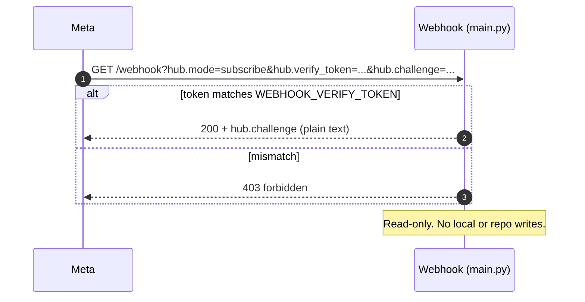
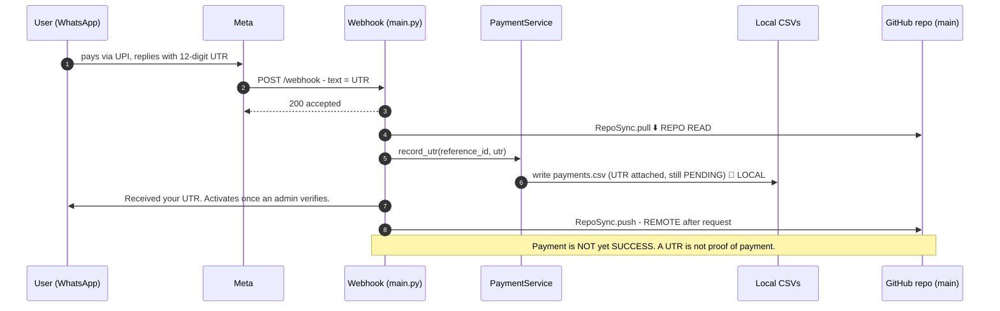
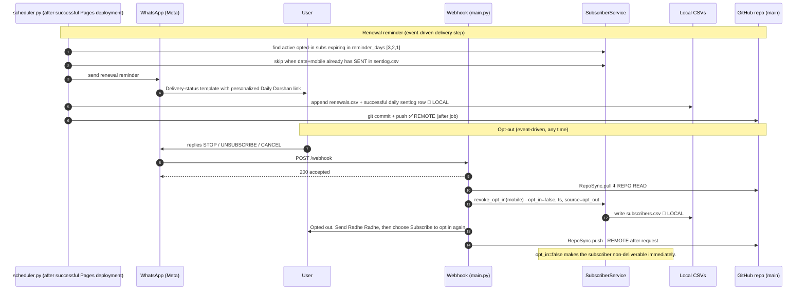

# Daily Darshan — Sequence Diagrams

These diagrams show **when** each operation runs and **at what stage it writes to
local disk vs. the shared GitHub repo (`main` branch)**.

Three kinds of flows:

- **Scheduled entry point** — only `Daily Image` has a cron (`03:01 UTC`, `08:31 IST target`).
  Successful completion starts the Pages-deployment and delivery chain.
- **Manual Actions** — image, Pages deployment, page regeneration and delivery can be run from
  the Actions tab. Direct delivery does not rebuild or redeploy pages.
- **Event-driven (untimed)** — the webhook on Render, triggered by WhatsApp/Meta. Writes via
  the **Contents API** (`GitHubApiRepository` through `RepoSync`): pull before and push after.

| Operation | Trigger | Time (UTC / IST) | Writes to repo? |
|-----------|---------|------------------|-----------------|
| Prune `logs.csv` + `sentlog.csv` | image and delivery workflows | At workflow execution | Only when rows outside the inclusive 30-day window exist |
| Fetch/store image + render pages | `image.yml` cron or manual | 03:01 / 08:31 target, or manual | Yes — signed commits of UUID-prefixed candidates, canonical image and pages |
| Expire subscriptions + prune inactive pages | end of `image.yml`; delivery safety repeat | Before publication | Yes when state/pages change |
| Deploy `docs/` | successful `Daily Image`, or manual | Event-driven | No repo write; one GitHub Pages deployment |
| Send renewal reminders | successful Pages deployment, or manual delivery | After publication | Yes — renewals, shared sentlog and logs |
| Deliver today's page link | same delivery run | After renewal/gap | Yes — sentlog and logs |
| GET `/webhook` (verify) | Meta handshake | any (setup) | No — read-only |
| POST `/webhook` (inbound) | user message | any | Yes — `RepoSync` pull then push |
| opt-in / name / subscribe / plan | inside POST | any | Yes (via the POST push) |
| User makes payment (UTR) | inside POST | any | Yes (via the POST push) |
| Admin verification | `admin.py` (manual) | any | Only with `--commit` |
| renewal reminder opt-out (STOP) | inside POST | any | Yes (via the POST push) |

The Render quiet window is disabled. Fixed windows cannot cover delayed or manual Actions runs,
and deferred writes on ephemeral disk can be lost. Writes use optimistic conflict handling.

---

## Write classification (read this first)

Every write in this system is one of two kinds, and the **push timing** differs by machine.

**Where the write lands**

| Symbol | Meaning |
|--------|---------|
| 📝 **LOCAL** | Write to the machine's local disk only. Not yet in the repo. On Render this disk is **ephemeral** (lost on restart) until pushed. |
| ✅ **REMOTE** | The change is now in the GitHub repo (`main`). This is what other machines see. |
| ⬇️ **REPO READ** | Pull from the repo into local disk. |

**When the local write reaches the remote (push timing)**

| Machine | Mechanism | Push timing |
|---------|-----------|-------------|
| **Scheduler** (GitHub Actions) | signed git CLI `commit` + `push` | **After each scheduler command** — cleanup (only if needed), image, expiry, renewal and delivery. Not per-subscriber. |
| **Admin** (`admin.py`) | git CLI `commit` + `push` | **Only if `--commit` is passed**, at the end of the command. Otherwise the write stays 📝 LOCAL and must be pushed **manually**. |
| **Webhook** (Render) | Contents API via `RepoSync` | **After background request handling**; stale-SHA conflicts fail safely for retry. |

So there are three push timings: **after each scheduler command**, **manual/optional** for admin,
and **immediate after background request handling** for the webhook.

---

## 1. Scheduled/manual image → publish → delivery pipeline

```mermaid
sequenceDiagram
    autonumber
    participant Trigger as Cron / manual image run
    participant Runner as Runner (checked-out repo = local)
    participant Sched as scheduler.py
    participant Pages as GitHub Pages
    participant WA as WhatsApp (Meta)
    participant Repo as GitHub repo (main)

    Note over Trigger,Repo: Daily Image — 03:01 UTC / 08:31 IST target, or manual on main
    Trigger->>Runner: checkout main
    Runner->>Sched: python scheduler.py cleanup (signed commit only if rows expire)
    Runner->>Sched: python scheduler.py image
    Sched->>Sched: fetch + validate all configured weekday sources; select largest
    Sched->>Runner: write UUID-prefixed candidates + canonical image  📝 LOCAL
    Sched->>Runner: render ALL per-subscriber pages (write_all)  📝 LOCAL
    Sched->>Repo: git commit + push (image + pages)  ✅ REMOTE (after job)
    Runner->>Sched: python scheduler.py expiry
    Sched->>Sched: for each ACTIVE past end_date: re-read row, flip -> EXPIRED  📝 LOCAL
    Sched->>Sched: prune inactive subscriber pages beyond grace period
    Sched->>Repo: git commit + push (subscribers.csv, logs.csv)  ✅ REMOTE (after job)

    alt image stored and image workflow succeeds on main
        Runner->>Pages: upload docs/ artifact and deploy once
        Pages-->>Runner: deployment success
    else image/deployment fails or image ran on another branch
        Note over Runner,WA: Stop — no automatic WhatsApp delivery
    end

    rect rgb(235,255,235)
    Note over Sched,Repo: Daily Delivery starts only after Pages succeeds
    Runner->>Sched: cleanup + idempotent expiry safety sweep
    Runner->>Sched: python scheduler.py renewal
    Sched->>Sched: find active opted-in subs expiring in [3,2,1]
    Sched->>WA: send reminder if date+mobile daily slot is free
    Sched->>Repo: commit + push renewals.csv, sentlog.csv, logs.csv
    end

    rect rgb(255,245,235)
    Note over Sched,Repo: Daily delivery for remaining eligible subscribers
    Runner->>Sched: python scheduler.py delivery
    Sched->>Sched: require today's valid image + free date+mobile slot
    Sched->>WA: send published utility page link (bounded retries)
    Sched->>Runner: append sentlog.csv (date+mobile)  📝 LOCAL
    Sched->>Repo: git commit + push (sentlog.csv, logs.csv)  ✅ REMOTE (after job)
    end
```

**Key stages where writes happen (scheduled):** each job writes to the runner's **local**
checkout first (📝 LOCAL), then does a **single `git commit` + `push` at the end of the job**
(✅ REMOTE). There is no mid-job repo write per subscriber — the CSV is committed once per
job. The runner's local disk is discarded when the job ends, so anything **not** committed is
lost; that's why every job commits before finishing.

**Page rendering here (image job):** `write_all()` writes
`docs/<subscription_id>/index.html` for **every** subscriber to the runner's local disk
(📝 LOCAL), and they are pushed with the image in the same end-of-job commit (✅ REMOTE).
Pages are regenerated **every run** so a subscriber who signed up since the last run gets a
page. The page is public only after the subsequent Pages deployment succeeds.

---

## 2. GET /webhook — verification handshake (no writes)



---

## 3. POST /webhook — inbound message (subscribe → plan → name → opt-in → pay)

This is the main event-driven flow. `RepoSync.pull()` runs at the start and
`RepoSync.push()` runs after background processing.

```mermaid
sequenceDiagram
    autonumber
    participant User as User (WhatsApp)
    participant Meta
    participant Web as Webhook (main.py)
    participant Svc as Services (subscriber/payment)
    participant Local as Local CSVs (Render disk)
    participant Repo as GitHub repo (main)

    User->>Meta: taps/sends message
    Meta->>Web: POST /webhook (signed)
    Web->>Web: verify HMAC signature
    Web-->>Meta: 200 "accepted" (ack fast)

    Note over Web,Repo: slow work runs in a background task
    Web->>Repo: RepoSync.pull() — fetch latest CSVs  ⬇️ REPO READ
    Repo-->>Local: overwrite local subscribers/payments/processed/logs

    Web->>Web: dedupe on message id (processed.csv)

    alt CTA_SUBSCRIBE
        Web->>User: send plan list (PLAN_*)
    else PLAN_[plan] selected
        Web->>Svc: upsert_pending(mobile, plan, name)
        Svc->>Local: write subscribers.csv (PENDING)  📝 LOCAL
        alt name missing
            Web->>User: "What name should we greet you by?"
            User->>Meta: types name
            Meta->>Web: POST /webhook (name)
            Web->>Svc: set_name(mobile, name)
            Svc->>Local: write subscribers.csv  📝 LOCAL
        end
        Web->>User: consent disclosure + "I agree" button
    else CTA_OPTIN_AGREE
        Web->>Svc: grant_opt_in(mobile, "whatsapp_cta")
        Svc->>Local: write subscribers.csv (opt_in=true, ts)  📝 LOCAL
        Web->>Svc: create_payment(mobile, plan) + UPI intent
        Svc->>Local: write payments.csv (PENDING)  📝 LOCAL
        Web->>User: UPI intent + reference id, "reply with 12-digit UTR"
    end

    Note over Web,Repo: after handling all messages in the payload
    Web->>Repo: RepoSync.push() — write CSVs back  ✅ REMOTE (after request)
    Note over Web,Repo: stale-SHA conflicts remain local and are retried; no ephemeral quiet-window deferral
```

If a synchronous WhatsApp reply fails, the handler restores the pre-message CSV snapshot and
releases the message id so the journey can be retried. Meta `statuses[]` callbacks also change a
previously accepted renewal/delivery ledger entry to `FAILED` when asynchronous delivery fails.

---

## 4. User makes payment (submits UTR)



---

## 5. Admin verification (out-of-band, manual)

```mermaid
sequenceDiagram
    autonumber
    participant Admin
    participant CLI as admin.py
    participant Pay as PaymentService
    participant Sub as SubscriberService
    participant Local as Local CSVs
    participant Repo as GitHub repo (main)

    Admin->>CLI: python admin.py verify [ref] --activate --commit
    CLI->>Pay: verify_payment(ref)  (status -> SUCCESS)
    Pay->>Local: write payments.csv  📝 LOCAL
    alt new subscriber
        CLI->>Sub: activate(mobile)  (PENDING -> ACTIVE)
        Note right of Sub: start_date = TODAY, end_date = TODAY + plan_days
    else existing (ACTIVE/PAUSED/EXPIRED) or --renew
        CLI->>Sub: renew(mobile)  (extend from current expiry, else today)
    end
    Sub->>Local: write subscribers.csv  📝 LOCAL
    CLI->>Local: render THIS subscriber's page (write_page, one page)  📝 LOCAL
    alt --commit
        CLI->>Repo: git commit + push (payments, subscribers, logs, this page)  ✅ REMOTE (not yet published)
        Note over CLI,Repo: Manually run Deploy Daily Darshan Pages to publish; success starts delivery
    else no --commit
        Note over CLI,Local: changes stay 📝 LOCAL only — must git commit + push MANUALLY
    end
```

**Admin machine + push:** `admin.py` runs on **whatever machine you invoke it on** (your
laptop or a maintenance box with a repo checkout), using the **git CLI** — the same mechanism
as the scheduler, not the webhook's Contents API. It renders **only the one subscriber's**
page (`write_page`), not all of them. The push is **not automatic**: it happens **only with
`--commit`** (at the end of the command). Without `--commit`, the CSV and page edits sit on
your local disk and you must `git add/commit/push` them yourself, or the delivery job (which
reads the repo) never sees the activation.

> ⚠️ **"Start from next day" discrepancy.** You asked for the subscription to start from the
> next day, but `Subscriber.activate()` currently sets `start_date = today` and
> `end_date = today + plan_days`. Delivery/eligibility is date-gated on `end_date`, so today
> is included. If "start next day" is the intended rule, `activate()` needs
> `start_date = today + 1` (and `end_date` adjusted accordingly). See notes below.

---

## 6. Renewal reminder + opt-out (STOP)



---

## When does web-page rendering happen?

A per-subscriber page is `docs/<subscription_id>/index.html` (the GitHub Pages target that the
utility-template link points to). It is rendered in **two** places:

| Trigger | Machine | What renders | Scope | Pushed to remote? |
|---------|---------|--------------|-------|-------------------|
| **Daily image job** (03:01 UTC / 08:31 IST target) | GitHub Actions | `PageRenderer.write_all()` | **All** subscribers, followed by inactive-page pruning | ✅ Committed automatically; published by the following Pages workflow |
| **Admin verification** with `--activate` | The machine running `admin.py` (e.g. your laptop) | `PageRenderer.write_page()` | **Only that one** subscriber | ⚠️ Only if you also pass `--commit`; otherwise **manual** push |

**Does payment verification render pages?** Yes — but only when you run `verify` with
`--activate`, and only for the **single** subscriber being activated. It runs on **whichever
machine you run `admin.py` on** (not Render, not the Actions runner unless you run it there).

**Is that render auto-pushed and published?** `admin.py` pushes only with `--commit`; without
it, you must commit/push manually. Even after a push, Actions-based Pages requires a deployment.
Run **Deploy Daily Darshan Pages** manually after reviewing a mid-day admin page; successful
publication then starts Daily Delivery.

**Why render on verification at all, instead of waiting for the next image job?**

Because the gap between activation and the next 03:01 UTC image job can be up to ~24 hours,
and during that gap the subscriber's link would be broken. Concretely:

1. **Immediate working link.** When you activate a subscriber mid-day, they may receive (or
   look up) their branded page URL right away. If the page didn't exist until the next image
   job, the URL would **404** until then. Rendering on activation guarantees the URL works
   after the explicit Pages deployment succeeds.
2. **Localized, cheap.** Activation already has the subscriber loaded and is already writing
   CSVs, so rendering that one page is a tiny extra step — no need to wait for or depend on the
   batch job.
3. **Non-blocking.** Page rendering on activation is best-effort: if it fails, activation still
   succeeds (the code logs a warning), and the next image job will render the page anyway.

So the two renders are complementary: **verification** covers the "works right now for this
one person" case; the **daily image job** is the catch-all that (re)builds **every** page
(and refreshes them for the new day's image).

---

## Timing summary

- **Only Daily Image has a fixed target time:** `03:01 UTC` / `08:31 IST`. Its successful
  completion triggers one Pages deployment; successful publication triggers delivery.
- **All webhook operations are event-driven** (no fixed time): verification, subscribe, plan,
  name, opt-in, UTR, opt-out. They write locally immediately and push to the repo at the end
  of background request handling. The quiet window is disabled because manual/delayed workflows
  cannot be bracketed reliably and Render's deferred local state is ephemeral.
- **Admin verification is manual** (run whenever a real payment is confirmed) and only writes
  to the repo when `--commit` is passed.
