# Daily Darshan webhook sequence diagrams

These diagrams describe production with `WEBHOOK_BEST_EFFORT_QUEUE=true`. They distinguish HTTP
acknowledgement, business processing, WhatsApp transport, Git persistence, and delivery receipts.
Dates are evaluated in IST unless stated otherwise.

## Shared ingress, processing, reply, and persistence

A `200 queued` response means only that the bounded in-memory queue accepted the event. It does not
mean the transition ran, Meta accepted a reply, the customer received it, or Git was updated.

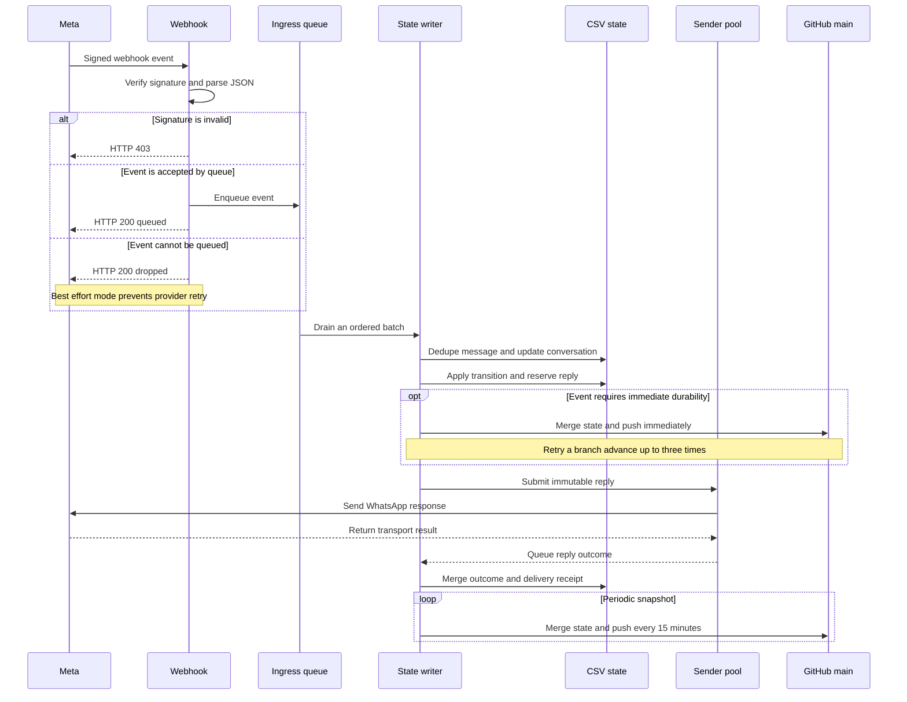

| Layer | Intermediate states |
|---|---|
| Ingress | accepted in queue, or dropped but acknowledged |
| Message | unseen → recorded in `processed.csv` → duplicate ignored |
| Conversation | version incremented → handler fields updated |
| Reply | reserved → prepared → `SENT`, `FAILED`, `UNKNOWN`, or `CANCELLED` |
| Receipt | sent → delivered → read with monotonic reconciliation |
| Ordinary persistence | memory dirty → periodic semantic merge → Git commit |
| Critical persistence | transition → immediate semantic merge and Git push → reply send |

The actor alone mutates state. Sender threads only perform network transport and return immutable
outcomes. Ordinary replies have no automatic retry in best-effort mode.

### Git persistence classification

| Inbound case | Lane | Git behavior |
|---|---|---|
| Any `ADMIN` text | Critical | Refresh state and push immediately, including an unauthorized denial reply |
| Any `ADM_*` admin button, including list, preview, approve, and reject | Critical | Merge and push immediately, including an unauthorized denial reply |
| `UTR_CONFIRM_*` or `UTR_EDIT_*` | Critical | Merge and push the confirmed or cleared draft immediately |
| `CTA_PAYMENT_REVIEW` for a rejected payment | Critical | Push `PAYMENT_REVIEW_REQUESTED` immediately before acknowledgement |
| Greeting, menu, status, plan selection, name, opt-in, payment creation, or UTR draft | Ordinary | Keep in memory and include in the normally 15-minute snapshot |
| STOP, resume consent, referral capture, provider status callback, and reply outcome | Ordinary | Keep in memory and include in the normally 15-minute snapshot |

An immediate critical snapshot serializes all currently dirty repositories, so earlier ordinary
changes already in memory may be included in that same commit. Remote payment state is coalesced at
most once per configured refresh interval for ordinary batches, but is refreshed for every critical
command. This payment refresh is distinct from the normal 15-minute full Git export.

## A. New user says Radhe Radhe and submits or revises a UTR

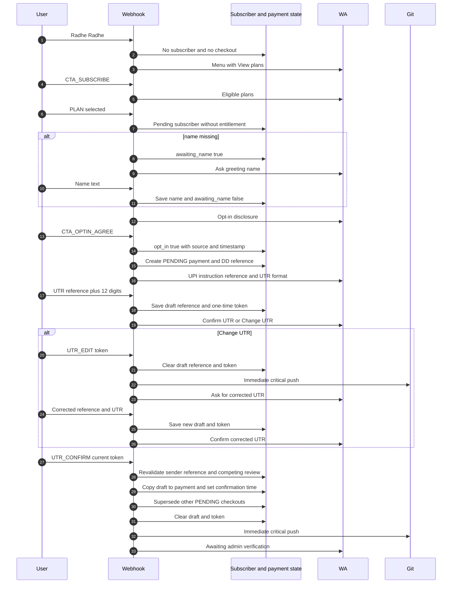

The subscriber remains non-entitled until admin approval. Typed UTR data is only a conversation
draft. The current sender-bound confirmation token moves it into `payments.csv`; stale tokens cannot.

## B. Existing user checks subscription and plans

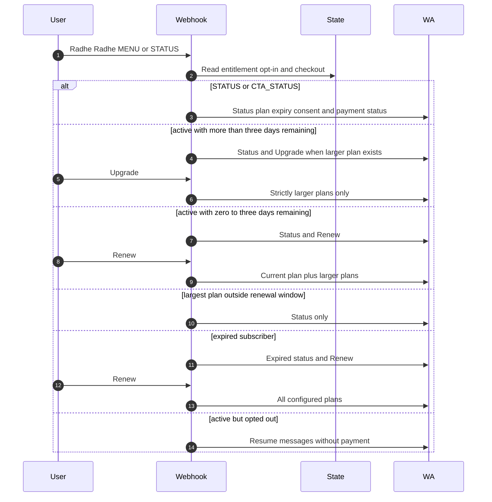

Plan rank is duration then amount. Checkout never changes paid entitlement before approval.
Same-plan renewal opens only in the last three calendar days, including expiry day.

## C. Existing user requests payment instructions and revises a UTR

The normal menu body remains generic in every payment state. Payment references, UTRs, amounts,
and administrator decisions are returned only after the customer selects Payment instructions or
Payment status. Review past UTR identifies only the relevant reference in its list row.

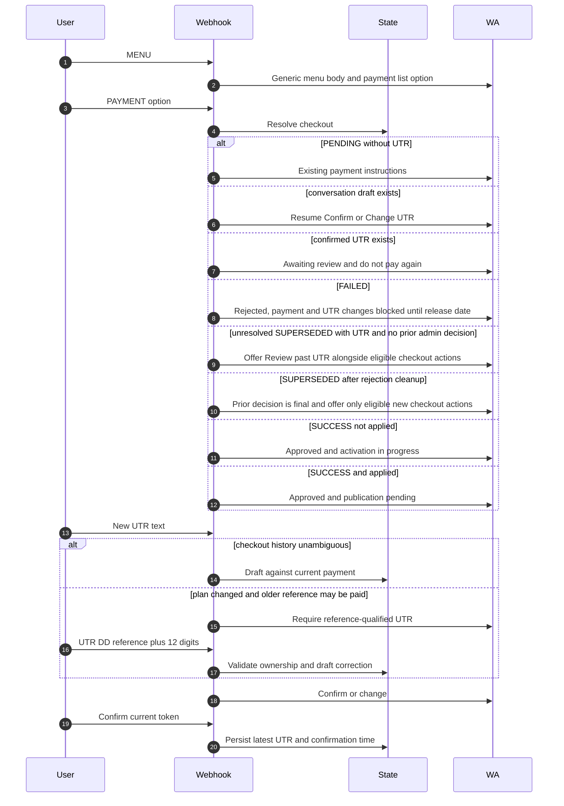

Confirmed payment evidence survives navigation and plan changes. A second payment confirmation is
blocked while another PENDING payment for that mobile is already under review.

## D. Active user upgrades and confirms payment

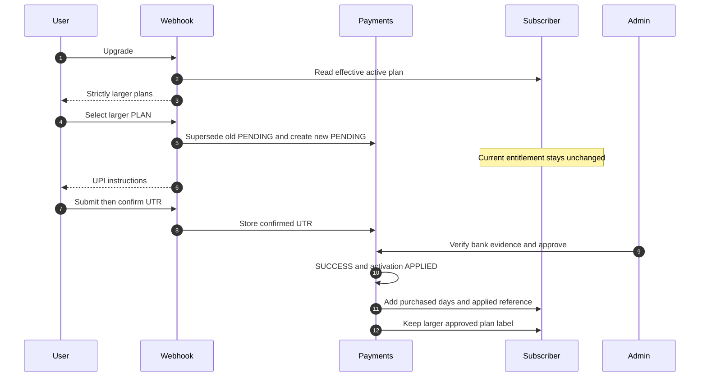

Approval extends an existing entitlement and prevents double credit with `applied_payment_refs` and
the payment `activation_state`.

## E. Expiring user renews and confirms payment

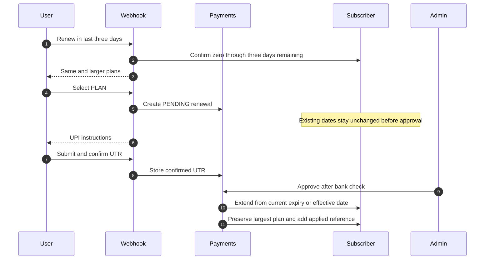

Outside the window, the same plan is ineligible but larger upgrades remain available. Expired users
may choose any configured plan.

## F. Customer requests another review after rejection

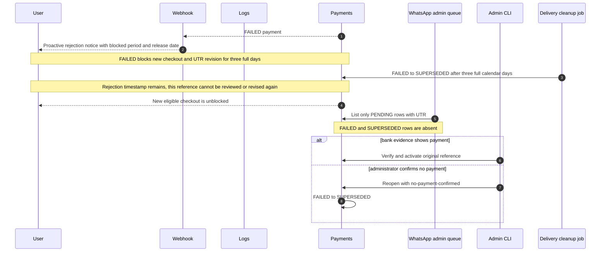

An unresolved `SUPERSEDED` UTR that has never been accepted or rejected follows a separate recovery
edge: customer Review past UTR changes it to `PENDING`, records `PAYMENT_REVIEW_REQUESTED`, and makes
it visible in the admin queue. After an admin decision, that reference can never use this edge again.

### Payment CSV state transitions and customer permissions

The diagram uses only values that can appear in `payments.csv.status`. UTR presence,
`rejected_at`, and `activation_state` are conditions on a row, not additional payment states.

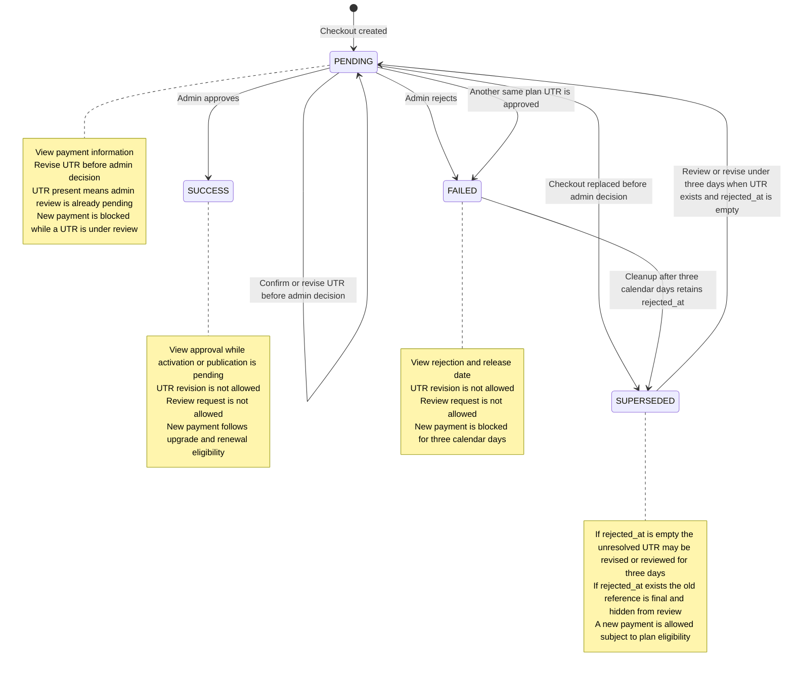

| `payments.csv.status` and row condition | View transaction/payment information | Revise UTR | Request admin review | Create another payment |
|---|---|---|---|---|
| `PENDING`, UTR empty | Yes, payment instructions | Yes | No, nothing submitted yet | Yes; replacing it makes the old row `SUPERSEDED` |
| `PENDING`, UTR present | Yes, verification pending | Yes, until an admin decision | Already in review automatically | No |
| `SUCCESS` | Yes while activation/publication is pending; afterward subscription status is shown | No | No | Only when upgrade or renewal rules permit |
| `FAILED` | Yes, including rejection and release date | No | No | No for three calendar days |
| `SUPERSEDED`, UTR present, `rejected_at` empty, under three days old | Reference is exposed through Review past UTR, not the normal payment-status card | Yes, using the reference | Yes; changes status to `PENDING` | Yes, subject to plan eligibility |
| `SUPERSEDED`, UTR present, `rejected_at` empty, at least three days old | No ordinary transaction action; retained for audit | No | No | Yes, subject to plan eligibility |
| `SUPERSEDED`, `rejected_at` present | No ordinary transaction action; retained for audit | No | No | Yes, subject to plan eligibility |
| `SUPERSEDED`, UTR empty | No ordinary transaction action | No | No | Yes, subject to plan eligibility |

The WhatsApp admin Review payments option contains only `PENDING` rows with a non-empty UTR.
`FAILED`, `SUPERSEDED`, and `SUCCESS` rows never appear in that queue.

## G. Admin selects the canonical image

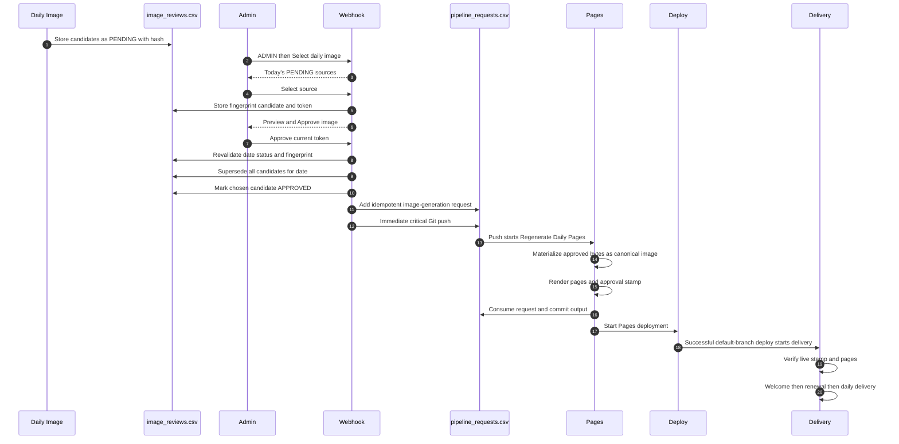

One `APPROVED` image is allowed per date, and its hash must match canonical bytes. Customer sends
wait for a live approval stamp. Welcome, renewal, and delivery share one date-plus-mobile slot.

## H. Admin approves payment and triggers welcome

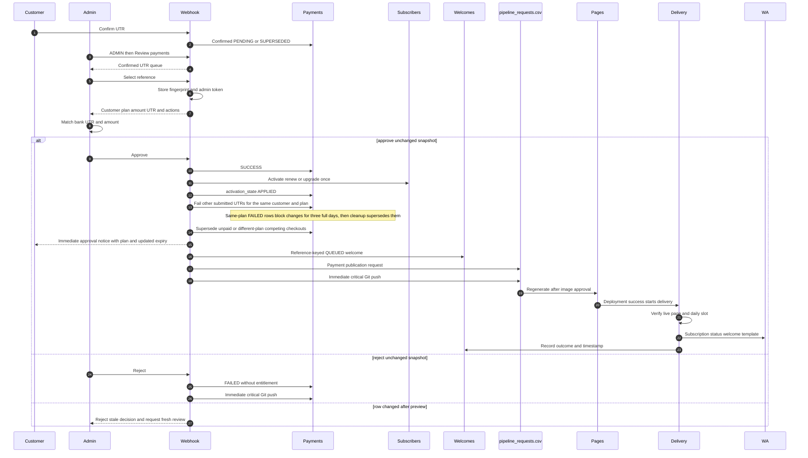

Approval is idempotent. Welcome is queued with entitlement but sent only after publication. If the
image is not approved, publication waits until a later image approval starts regeneration.

## I. Other workflows and exceptional paths

### Opt out and resume

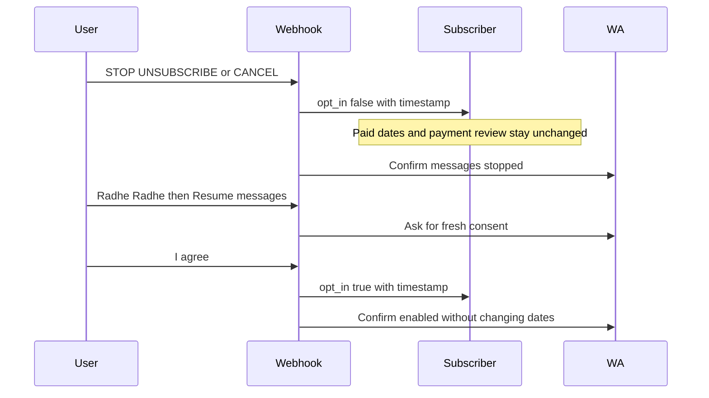

### Receipts, duplicates, malformed, and unsupported events

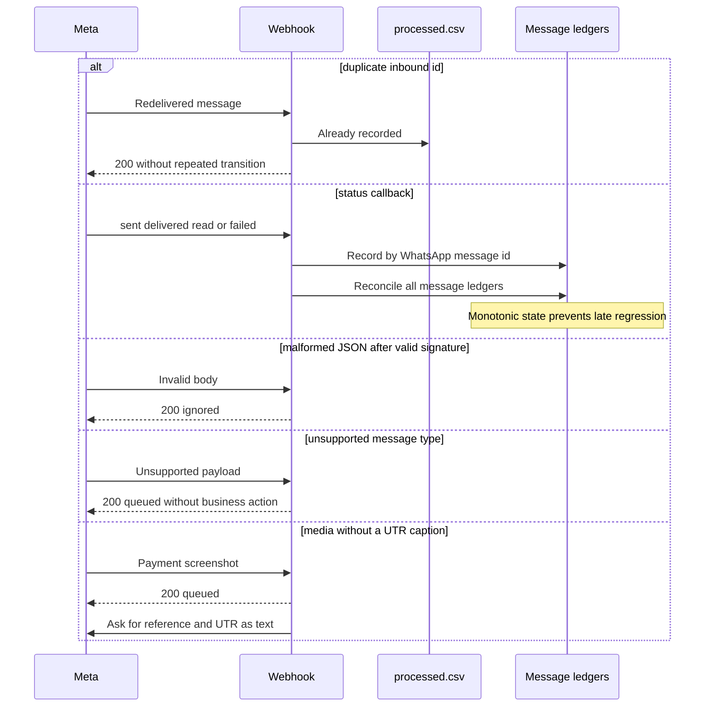

`MENU`, `RADHE RADHE`, `PAYMENT`, `RENEW`, `SUBSCRIBE`, `BACK`, `CONTINUE`, and `RESEND`
navigate without approving payment. Unknown buttons return a safe current menu. Recovery is
rate-limited for 30 seconds. Admin and UTR actions validate tokens, ownership, status, and row
fingerprints.

## State ownership summary

| State | Primary key | Main transitions | Persistence timing |
|---|---|---|---|
| Subscriber | mobile | pending → active, active → expired, opt-in true or false | periodic or immediate admin approval |
| Payment | reference | PENDING without decision ↔ unresolved SUPERSEDED; PENDING review → SUCCESS or FAILED; FAILED → final SUPERSEDED after cleanup | UTR, re-review promotion and admin decisions immediate |
| UTR draft | conversation mobile | empty → drafted → edited or confirmed → empty | draft periodic, edit and confirm immediate |
| Welcome | payment reference | QUEUED → PENDING → SENT → DELIVERED or FAILED | delivery workflow commits |
| Renewal | mobile type expiry | eligible → PENDING → SENT → DELIVERED or FAILED | delivery workflow commits |
| Daily contact | date and mobile | free → PENDING → SENT → DELIVERED or FAILED | delivery workflow commits |
| Image review | candidate id | PENDING → APPROVED or SUPERSEDED | image approval immediate |
| Pipeline request | image generation or payment | absent → queued → consumed | approval then Pages workflow |
| Webhook reply | reply id | reserved → prepared → SENT or terminal outcome | periodic unless critical |

## Operational boundaries

- GET webhook verification is read-only and returns a challenge only for the configured token.
- HTTP success in best-effort mode is not a durability promise. Overflow, process restart before a
  snapshot, initialization failure, or critical Git failure can lose an acknowledged event.
- Ordinary replies are not automatically retried. `/internal/retry-replies` is disabled in this mode.
- Shared business CSVs use semantic row merges. The actor is the in-process writer and Git branch
  compare-and-swap protects cross-process publication.
- Provider `SENT` means Meta accepted the message. Only later `DELIVERED` or `READ` proves further
  progression.
