# Daily Darshan — Sequence Diagrams

## Webhook snapshot and bounded reply processing

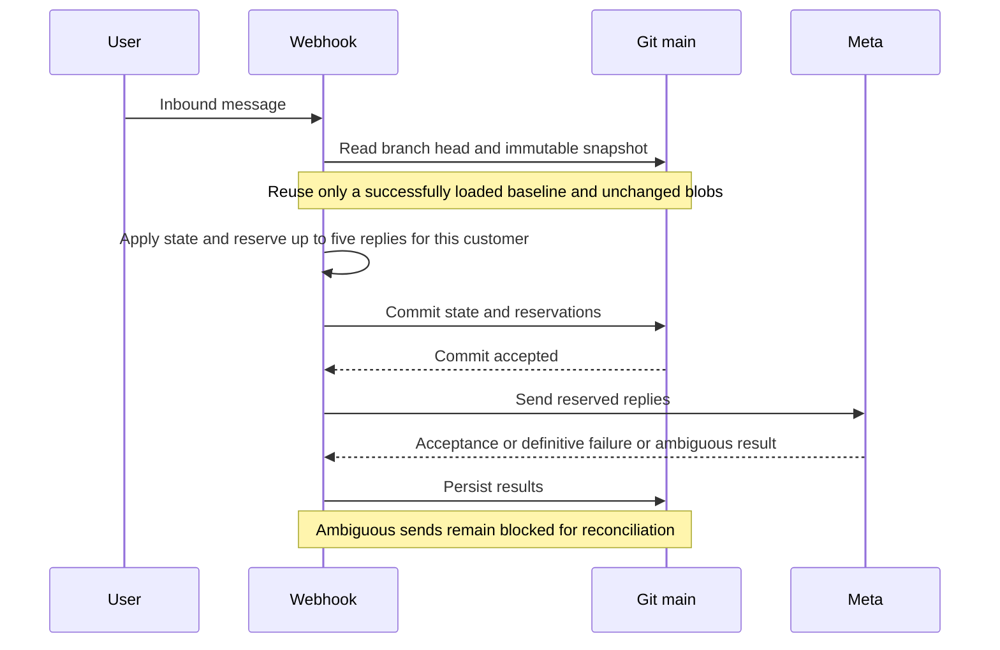

The retry endpoint uses the same bounded preparation across customers. A status-only
callback does not drain unrelated replies. Commit failures before sending abort the
send; failures after sending require reconciliation rather than blind retries.

These diagrams show **when** each operation runs and **at what stage it writes to
local disk vs. the shared GitHub repo (`main` branch)**.

Three kinds of flows:

- **Image entry point** — Daily Image currently uses manual/external dispatch. Collection
  queues admin review; the committed decision starts regeneration, deployment and delivery.
- **Manual Actions** — image, Pages deployment, page regeneration and delivery can be run from
  the Actions tab. Direct delivery does not rebuild or redeploy pages.
- **Event-driven (untimed)** — the webhook on Render, triggered by WhatsApp/Meta. Writes via
  the **Git Data API** (`GitHubApiRepository` through `RepoSync`): snapshot read before handling,
  atomic publication before HTTP acknowledgement.

| Operation | Trigger | Time (UTC / IST) | Writes to repo? |
|-----------|---------|------------------|-----------------|
| Prune `logs.csv` + `sentlog.csv` | image and delivery workflows | At workflow execution | Only when rows outside the inclusive 30-day window exist |
| Fetch/store image candidates | `image.yml` manual/external dispatch | On demand | Yes — candidates and pending admin review batch |
| Expire subscriptions + prune inactive pages | end of `image.yml`; delivery safety repeat | Before publication | Yes when state/pages change |
| Deploy `docs/` | successful approved page regeneration, or manual | Event-driven | No repo write; gate requires approved bytes and rendered stamp |
| Send renewal reminders | successful Pages deployment, or manual delivery | After publication | Yes — renewals, shared sentlog and logs |
| Deliver today's page link | same delivery run | After renewal/gap | Yes — sentlog and logs |
| GET `/webhook` (verify) | Meta handshake | any (setup) | No — read-only |
| POST `/webhook` (inbound) | user message | any | Yes — `RepoSync` pull then push |
| opt-in / name / subscribe / plan | inside POST | any | Yes (via the POST push) |
| User makes payment (UTR) | inside POST | any | Yes (via the POST push) |
| Admin verification | WhatsApp ADMIN or CLI | any | Atomic webhook commit, or CLI with `--commit` |
| renewal reminder opt-out (STOP) | inside POST | any | Yes (via the POST push) |

Webhook persistence has no clock-based quiet window. Fixed windows cannot cover delayed or
manual Actions runs, and deferred writes on ephemeral disk can be lost. Repository conflicts
fail closed and request retry.

---

## Write classification (read this first)

Every write in this system is one of two kinds, and the **push timing** differs by machine.

**Where the write lands**

| Symbol | Meaning |
|--------|---------|
| 📝 **LOCAL** | Write to the machine's local disk only. Not yet in the repo. On Render this disk is **ephemeral** (lost on restart) until pushed. |
| ✅ **REMOTE** | The change is now in the GitHub repo (`main`). This is what other machines see. |
| ⬇️ **REPO READ** | Pull from the repo into local disk. |

**When the local write reaches the remote (push timing)**

| Machine | Mechanism | Push timing |
|---------|-----------|-------------|
| **Scheduler** (GitHub Actions) | signed git CLI `commit` + `push` | After each command, plus a per-subscriber reservation **before** each send and its outcome **after**. |
| **Admin** (`admin.py`) | git CLI `commit` + `push` | **Only if `--commit` is passed**, at the end of the command. Otherwise the write stays 📝 LOCAL and must be pushed **manually**. |
| **Webhook** (Render) | Git Data API via `RepoSync` | Atomic CSV publication **before HTTP 200**; concurrent branch advances reject stale snapshots and return 503. |

Push timings are per-command/per-contact for the scheduler, optional for admin, and
before acknowledgement for the webhook.

---

## 1. Image collection → admin selection → publication → delivery

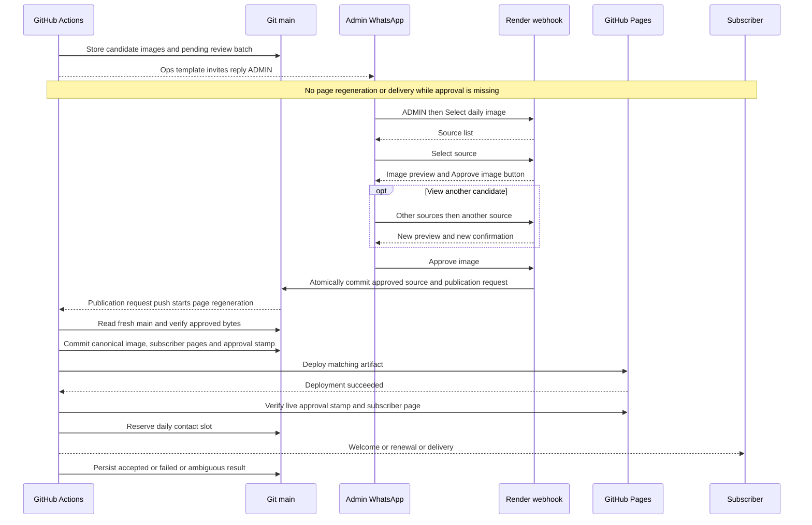

A stale preview, changed image, previous-day selection or unauthorized sender cannot approve.
Pending runs release their runners. Page publication rebuilds from fresh main on bounded Git
conflicts. A repeat image run preserves an already-approved selection. Each send reservation
is committed before contacting Meta; ambiguous outcomes remain blocked for reconciliation.

---

## 2. GET /webhook — verification handshake (no writes)

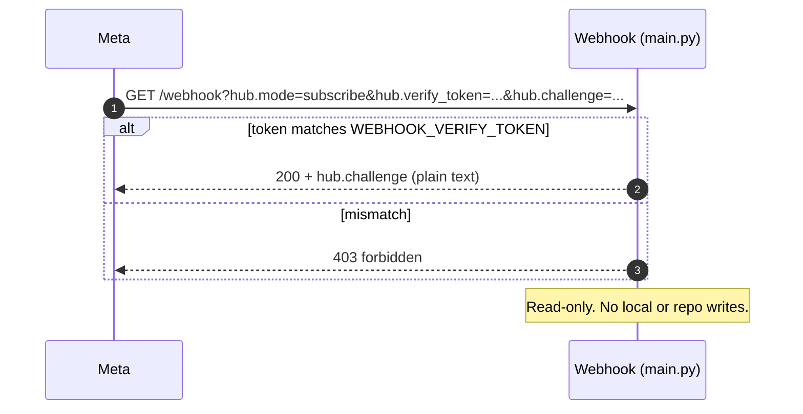

---

## 3. POST /webhook — inbound message (subscribe → plan → name → opt-in → pay)

This is the main event-driven flow. `RepoSync.pull()` runs at the start and
`RepoSync.push()` publishes an atomic CSV transaction before HTTP acknowledgement.

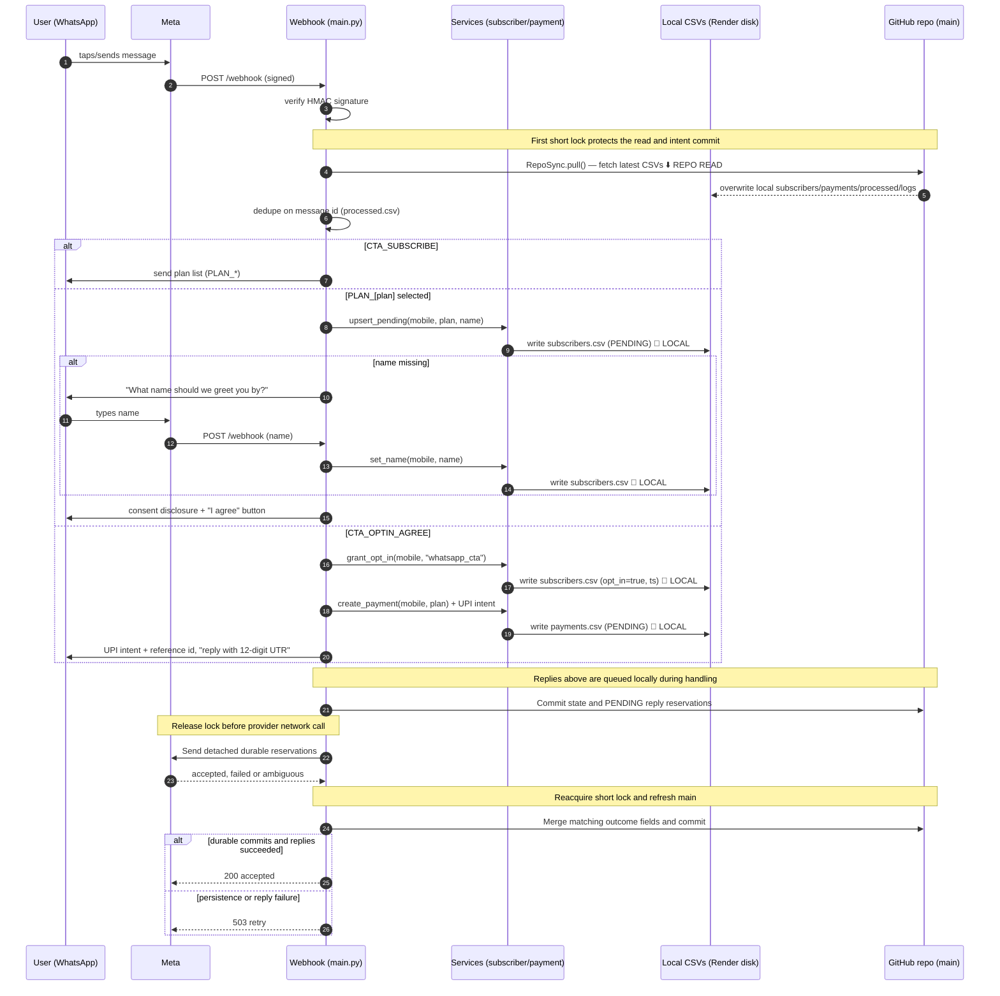

Failed conversational replies restore pre-message state. STOP and confirmed UTR are retained with a
durable acknowledgement retry record instead. Callbacks are stored even before their send row
exists; delivered/read evidence wins over delayed failures. Uncertain sends hold the daily slot.

### 3a. Navigation, backtracking and stale CTA cases

The conversation is intentionally recoverable. `BACK`, `GO BACK`, `PREVIOUS`, `MENU`,
`Radhe Radhe`, `RENEW` and `SUBSCRIBE` are navigation commands at every step. They never become
the subscriber's name, create a payment, change consent, or consume a daily delivery slot.

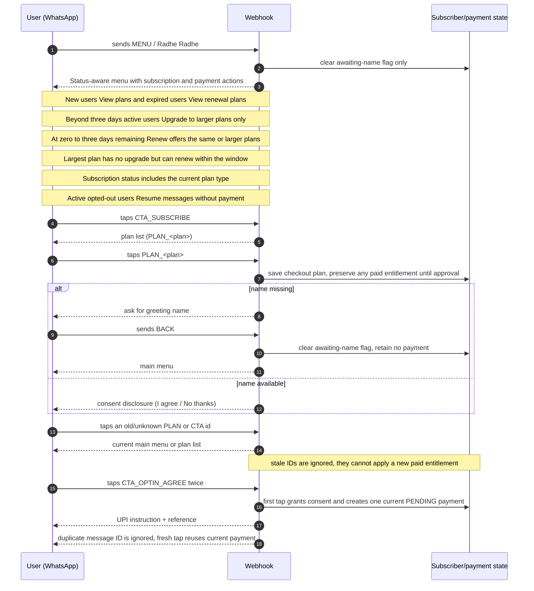

### 3b. Payment and UTR recovery cases

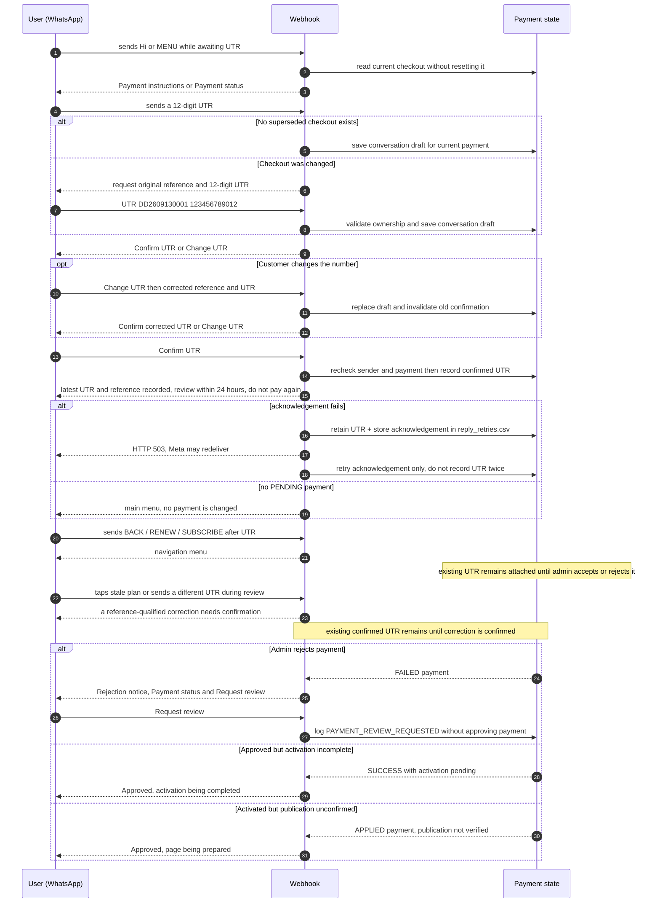

Navigation during name/consent shows the missing prompt without saving the greeting as a
name. Active opted-out users retain Resume messages even during payment review; its consent
action leaves checkout unchanged. Admin `reopen-payment --no-payment-confirmed` resolves
rejection only when no payment occurred. A real payment must be verified against its original
reference instead. Daily publication checks additionally inspect the displayed image date;
welcome/renewal publication checks remain independent. Obsolete activation welcomes are cancelled.

### 3c. Menu options by entitlement and expiry

This diagram uses short participant names and one action per line so GitHub Mermaid renders it
consistently. The menu is derived from persisted state each time; unexpected text or stale buttons
return the user to a safe step without changing payment or entitlement.

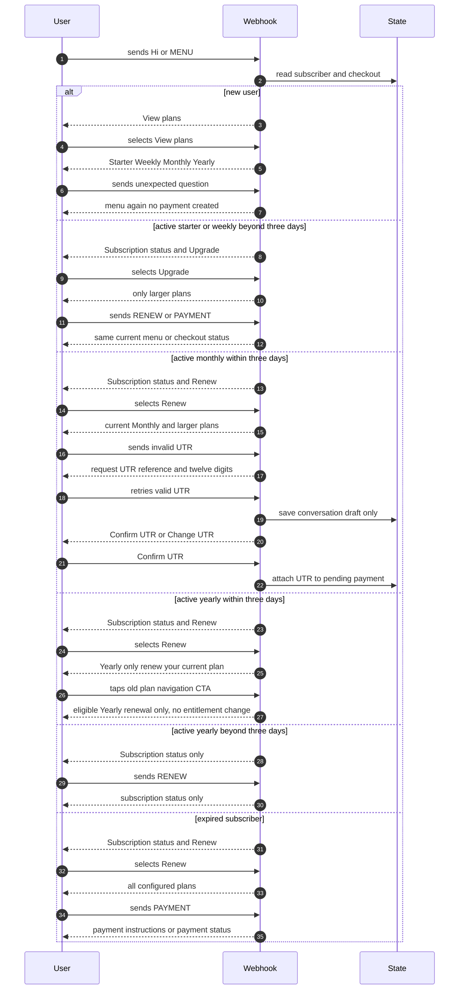

---

## 4. User makes payment (submits UTR)

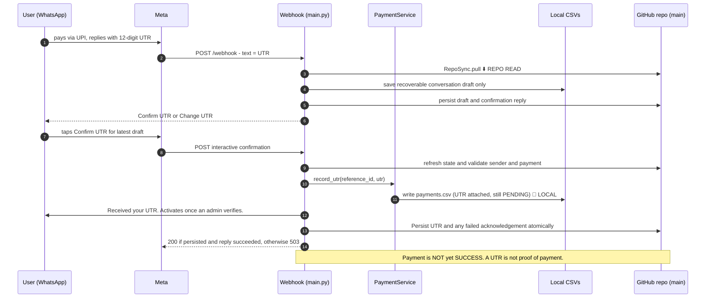

---

## 5. Admin payment verification on WhatsApp

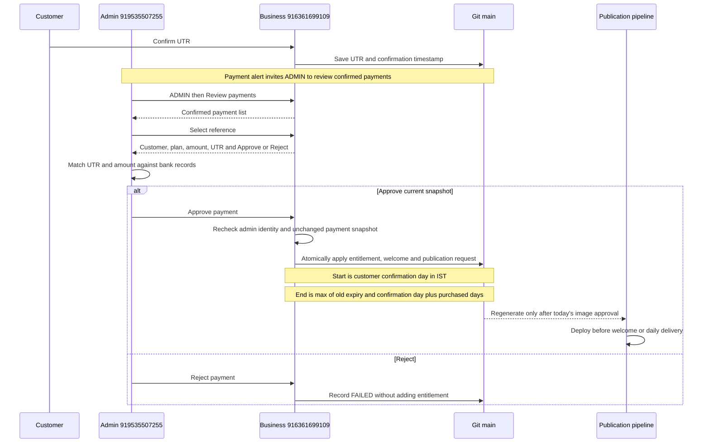

CLI verification remains available. With image approval enabled, it queues publication rather
than rendering locally. Use `--commit` to publish the CSV transaction; if its Git credentials do
not trigger push workflows, manually run Regenerate Daily Pages. Records without a historical
confirmation timestamp use the approval date. Applied payment references prevent double credit.
Approval is a human check against bank evidence, not automated financial verification.

---

## 6. Renewal reminder + opt-out (STOP)

Renewal eligibility and the page CTA open three IST calendar days before expiry, including
expiry day; reminder scheduling does not change that window. Payment and old CTA recovery
recheck eligibility. Obsolete unpaid checkouts become SUPERSEDED, but recorded UTRs and
reference-qualified UTR submissions remain reviewable without requesting another payment.

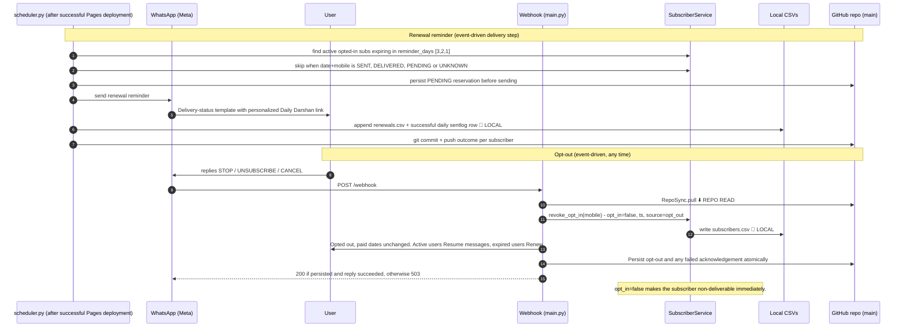

## 7. Welcome versus daily delivery

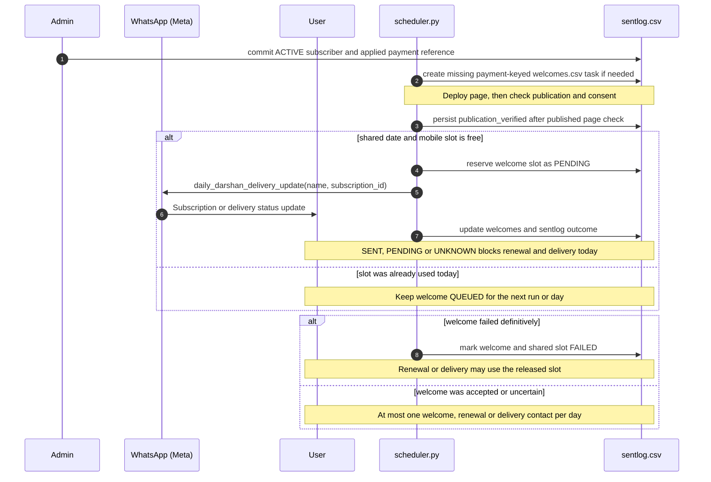

The welcome event proves activation; it is not evidence that a daily image was delivered.
The delivery event proves only that Meta accepted the daily template (`SENT`) unless a later
`delivered` or `read` status is received. A provider timeout is `UNKNOWN` and blocks automatic
reruns until reconciled, preventing duplicate customer messages.

---

## When does web-page rendering happen?

With production image approval enabled, Regenerate Daily Pages is the rendering entry point.
Admin image approval and payment activation create idempotent publication requests. If today's
image is not yet approved, the request's workflow skips and the eventual image approval starts a
fresh run covering all active subscribers. Manual page regeneration enforces the same gate.

The job checks the selected image hash, renders subscriber pages and an approval stamp, then
deploys. Customer message jobs verify that stamp is live and check individual subscriber pages.
CLI activation does not write pages in this mode. Existing public pages remain available while
approval is pending. The old automatic image/render path is used only if approval is disabled.

---

## Timing summary

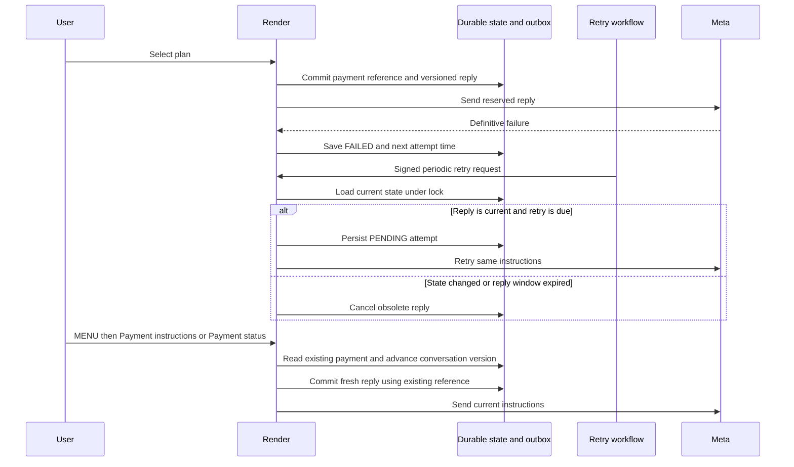

- **Reply recovery** has a best-effort five-minute GitHub Actions schedule and manual dispatch.
  Unknown attempts require reconciliation; a user-requested resend may duplicate an earlier
  message already accepted by Meta, but never repeats the payment/activation mutation.

- **Image collection and payment alerts are manual/external entry points.** Image approval
  starts regeneration, then successful deployment triggers delivery.
- **All webhook operations are event-driven** (no fixed time): verification, subscribe, plan,
  name, opt-in, UTR, opt-out. They publish the state transaction before HTTP acknowledgement.
  Failures request retries with 503. Manual/delayed workflows use repository conflict detection;
  no fixed time window makes the webhook unavailable.
- **Admin verification is a human decision.** WhatsApp approval commits automatically through
  the webhook transaction; CLI approval still needs `--commit`.
