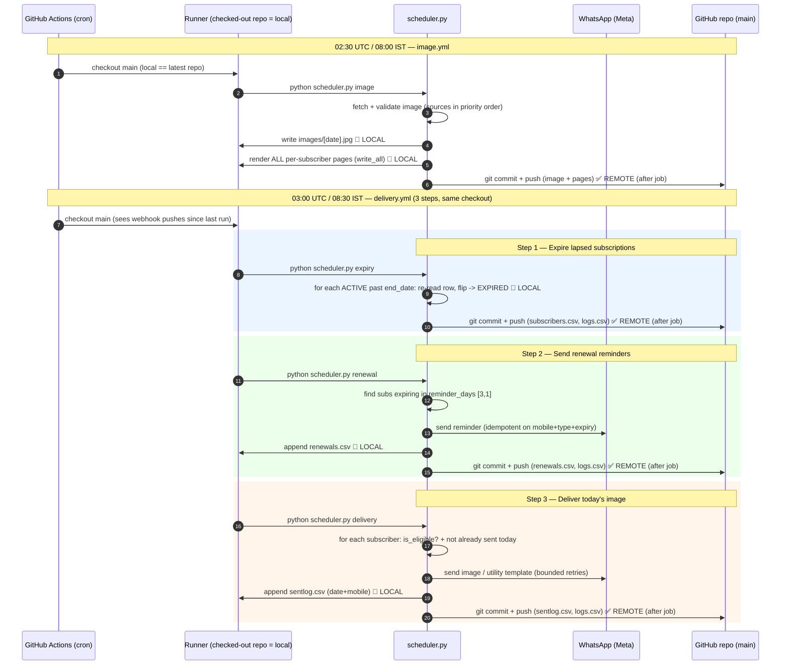
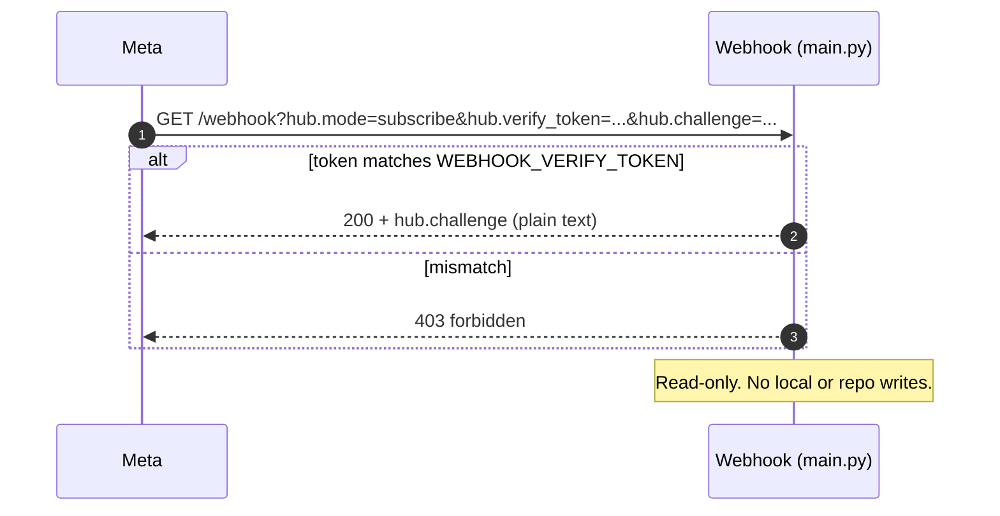
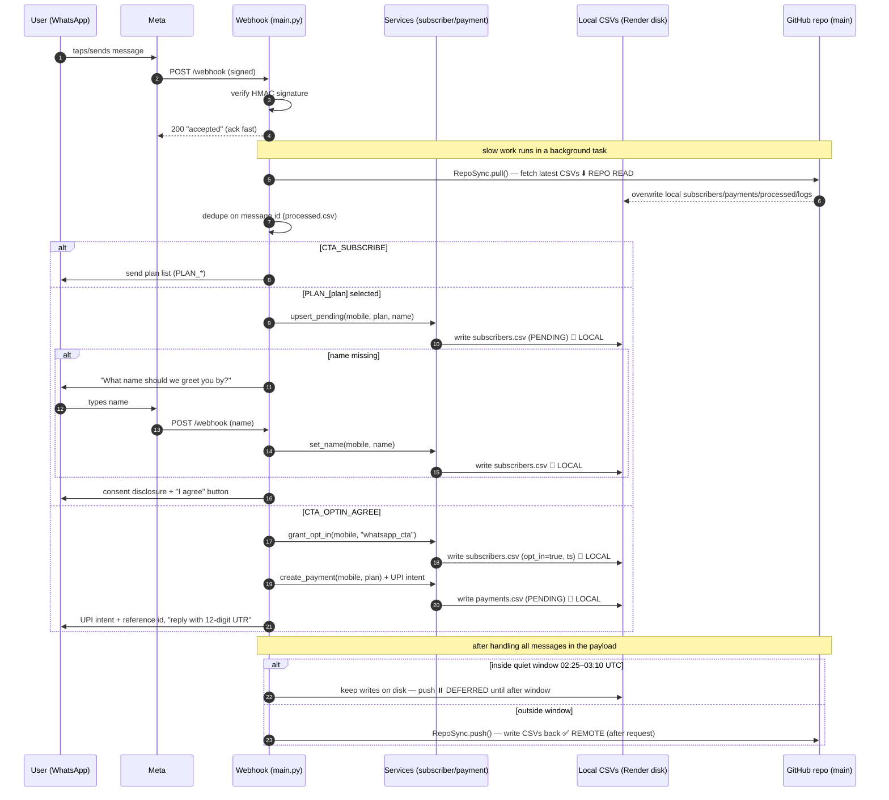
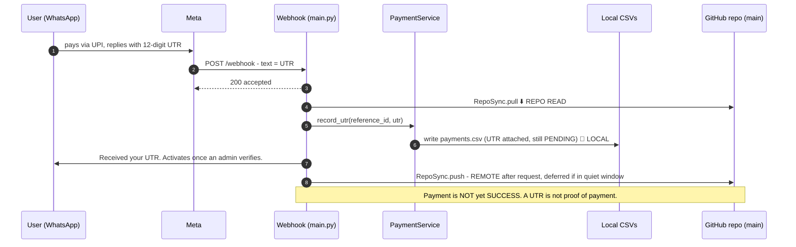
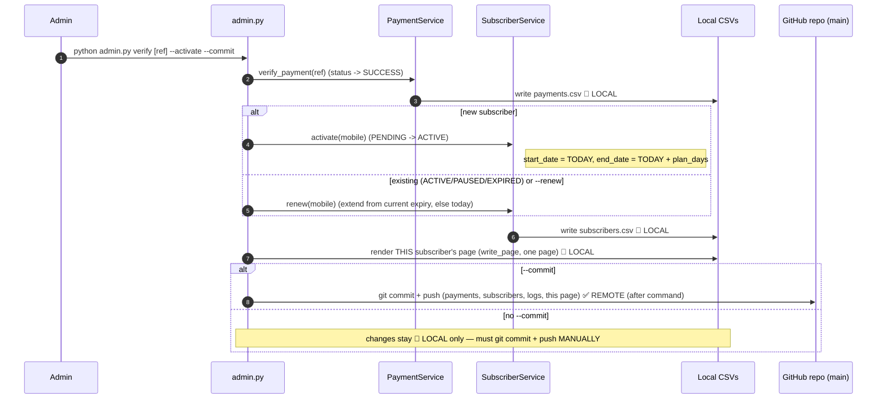
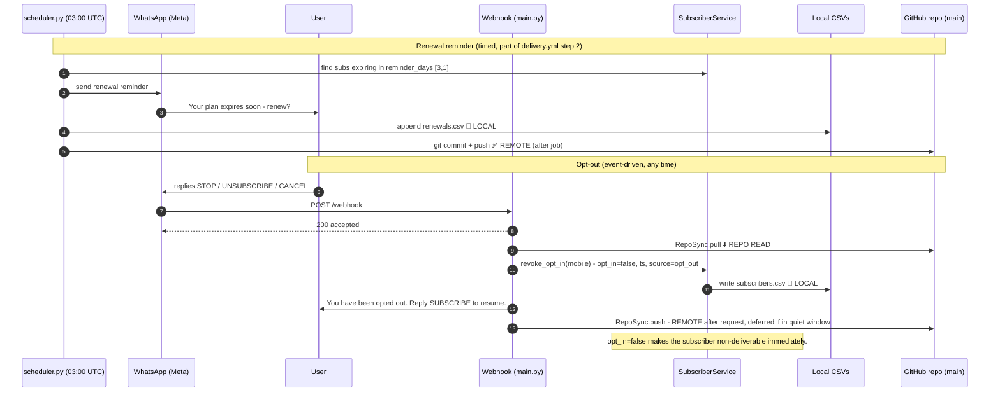

# Daily Darshan — Sequence Diagrams

These diagrams show **when** each operation runs and **at what stage it writes to
local disk vs. the shared GitHub repo (`main` branch)**.

Two kinds of flows:

- **Scheduled (timed)** — run by GitHub Actions cron. Fixed UTC times. Write via the
  **git CLI** (`LocalGitRepository`): local file write, then `git commit` + `git push`.
- **Event-driven (untimed)** — the webhook on Render, triggered by WhatsApp/Meta. Writes via
  the **Contents API** (`GitHubApiRepository` through `RepoSync`): `pull` before, `push` after
  (deferred during the 02:25–03:10 UTC quiet window).

| Operation | Trigger | Time (UTC / IST) | Writes to repo? |
|-----------|---------|------------------|-----------------|
| Fetch and store today's image | `image.yml` cron | 02:30 / 08:00 | Yes — `git commit` image + pages |
| Expire lapsed subscriptions | `delivery.yml` cron (step 1) | 03:00 / 08:30 | Yes — `git commit` subscribers, logs |
| Send renewal reminders | `delivery.yml` cron (step 2) | 03:00 / 08:30 | Yes — `git commit` renewals, logs |
| Deliver today's image | `delivery.yml` cron (step 3) | 03:00 / 08:30 | Yes — `git commit` sentlog, logs |
| GET `/webhook` (verify) | Meta handshake | any (setup) | No — read-only |
| POST `/webhook` (inbound) | user message | any | Yes — `RepoSync` pull then push* |
| opt-in / name / subscribe / plan | inside POST | any | Yes (via the POST push) |
| User makes payment (UTR) | inside POST | any | Yes (via the POST push) |
| Admin verification | `admin.py` (manual) | any | Only with `--commit` |
| renewal reminder opt-out (STOP) | inside POST | any | Yes (via the POST push) |

\* Webhook push is **deferred** while inside the quiet window (02:25–03:10 UTC) and flushed
on the next push after it closes.

---

## Write classification (read this first)

Every write in this system is one of two kinds, and the **push timing** differs by machine.

**Where the write lands**

| Symbol | Meaning |
|--------|---------|
| 📝 **LOCAL** | Write to the machine's local disk only. Not yet in the repo. On Render this disk is **ephemeral** (lost on restart) until pushed. |
| ✅ **REMOTE** | The change is now in the GitHub repo (`main`). This is what other machines see. |
| ⬇️ **REPO READ** | Pull from the repo into local disk. |

**When the local write reaches the remote (push timing)**

| Machine | Mechanism | Push timing |
|---------|-----------|-------------|
| **Scheduler** (GitHub Actions) | git CLI `commit` + `push` | **After the job completes** — one commit at the end of each job (image / expiry / renewal / delivery). Not per-subscriber. |
| **Admin** (`admin.py`) | git CLI `commit` + `push` | **Only if `--commit` is passed**, at the end of the command. Otherwise the write stays 📝 LOCAL and must be pushed **manually**. |
| **Webhook** (Render) | Contents API via `RepoSync` | **After request handling**, unless inside the **02:25–03:10 UTC quiet window** → **deferred** and flushed on the next push after the window closes. |

So there are effectively three push timings: **after job completion** (scheduler), **manual/optional** (admin without `--commit`), and **immediate-after-request-or-deferred** (webhook).

---

## 1. Scheduled jobs timeline (the nightly window)

**Key stages where writes happen (scheduled):** each job writes to the runner's **local**
checkout first (📝 LOCAL), then does a **single `git commit` + `push` at the end of the job**
(✅ REMOTE). There is no mid-job repo write per subscriber — the CSV is committed once per
job. The runner's local disk is discarded when the job ends, so anything **not** committed is
lost; that's why every job commits before finishing.

**Page rendering here (image job):** step in the 02:30 image job. `write_all()` writes
`docs/<subscription_id>/index.html` for **every** subscriber to the runner's local disk
(📝 LOCAL), and they are pushed with the image in the same end-of-job commit (✅ REMOTE).
Pages are regenerated **every run** so a subscriber who signed up since the last run gets a
page.

---

## 2. GET /webhook — verification handshake (no writes)

---

## 3. POST /webhook — inbound message (subscribe → plan → name → opt-in → pay)

This is the main event-driven flow. Note **when** local disk and the repo are written:
`RepoSync.pull()` at the start, `RepoSync.push()` at the end (deferred if in quiet window).

---

## 4. User makes payment (submits UTR)

---

## 5. Admin verification (out-of-band, manual)

**Admin machine + push:** `admin.py` runs on **whatever machine you invoke it on** (your
laptop or a maintenance box with a repo checkout), using the **git CLI** — the same mechanism
as the scheduler, not the webhook's Contents API. It renders **only the one subscriber's**
page (`write_page`), not all of them. The push is **not automatic**: it happens **only with
`--commit`** (at the end of the command). Without `--commit`, the CSV and page edits sit on
your local disk and you must `git add/commit/push` them yourself, or the delivery job (which
reads the repo) never sees the activation.

> ⚠️ **"Start from next day" discrepancy.** You asked for the subscription to start from the
> next day, but `Subscriber.activate()` currently sets `start_date = today` and
> `end_date = today + plan_days`. Delivery/eligibility is date-gated on `end_date`, so today
> is included. If "start next day" is the intended rule, `activate()` needs
> `start_date = today + 1` (and `end_date` adjusted accordingly). See notes below.

---

## 6. Renewal reminder + opt-out (STOP)

---

## When does web-page rendering happen?

A per-subscriber page is `docs/<subscription_id>/index.html` (the GitHub Pages target that the
utility-template link points to). It is rendered in **two** places:

| Trigger | Machine | What renders | Scope | Pushed to remote? |
|---------|---------|--------------|-------|-------------------|
| **Daily image job** (02:30 UTC) | GitHub Actions | `PageRenderer.write_all()` | **All** subscribers | ✅ Yes — automatically, in the same end-of-job commit as the image |
| **Admin verification** with `--activate` | The machine running `admin.py` (e.g. your laptop) | `PageRenderer.write_page()` | **Only that one** subscriber | ⚠️ Only if you also pass `--commit`; otherwise **manual** push |

**Does payment verification render pages?** Yes — but only when you run `verify` with
`--activate`, and only for the **single** subscriber being activated. It runs on **whichever
machine you run `admin.py` on** (not Render, not the Actions runner unless you run it there).

**Is that render auto-pushed?** No, not by default. `admin.py` writes the page 📝 LOCAL and
pushes to the repo **only if `--commit` is supplied**. Without `--commit` you must push
manually. (The daily image job's render, by contrast, is always auto-committed.)

**Why render on verification at all, instead of waiting for the next image job?**

Because the gap between activation and the next 02:30 UTC image job can be up to ~24 hours,
and during that gap the subscriber's link would be broken. Concretely:

1. **Immediate working link.** When you activate a subscriber mid-day, they may receive (or
   look up) their branded page URL right away. If the page didn't exist until the next image
   job, the URL would **404** until then. Rendering on activation guarantees the URL works
   immediately (modulo GitHub Pages' ~1-minute publish delay after the commit).
2. **Localized, cheap.** Activation already has the subscriber loaded and is already writing
   CSVs, so rendering that one page is a tiny extra step — no need to wait for or depend on the
   batch job.
3. **Non-blocking.** Page rendering on activation is best-effort: if it fails, activation still
   succeeds (the code logs a warning), and the next image job will render the page anyway.

So the two renders are complementary: **verification** covers the "works right now for this
one person" case; the **daily image job** is the catch-all that (re)builds **every** page
(and refreshes them for the new day's image).

---

## Timing summary

- **Only the scheduled jobs are mapped to specific times** (UTC):
  - `02:30` image (+ pages)
  - `03:00` expiry → renewal → delivery (sequential, one workflow)
- **All webhook operations are event-driven** (no fixed time): verification, subscribe, plan,
  name, opt-in, UTR, opt-out. They write locally immediately and push to the repo at the end
  of request handling — **deferred** during the `02:25–03:10` UTC quiet window so they don't
  collide with the nightly jobs.
- **Admin verification is manual** (run whenever a real payment is confirmed) and only writes
  to the repo when `--commit` is passed.
